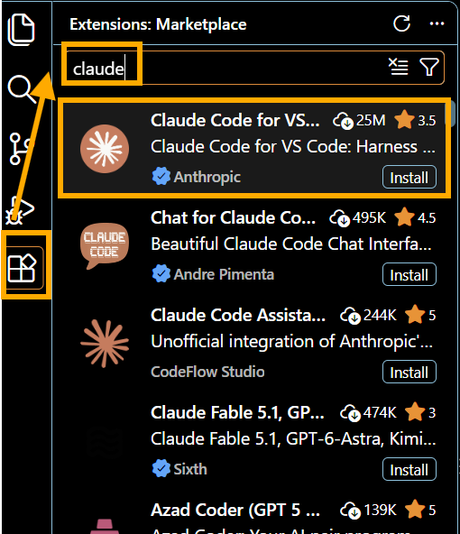
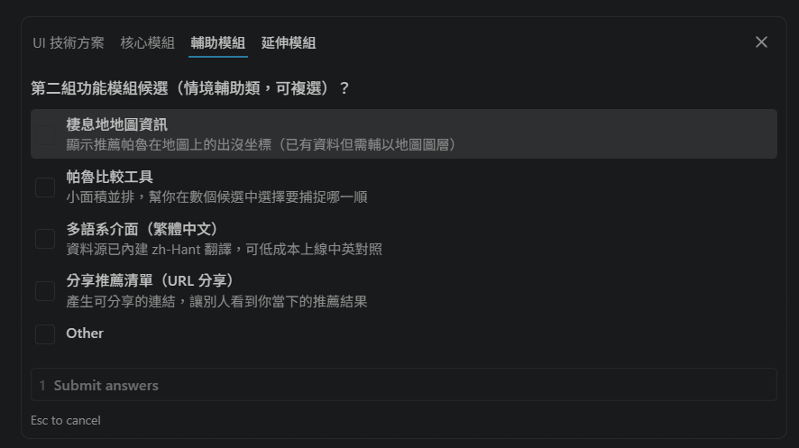
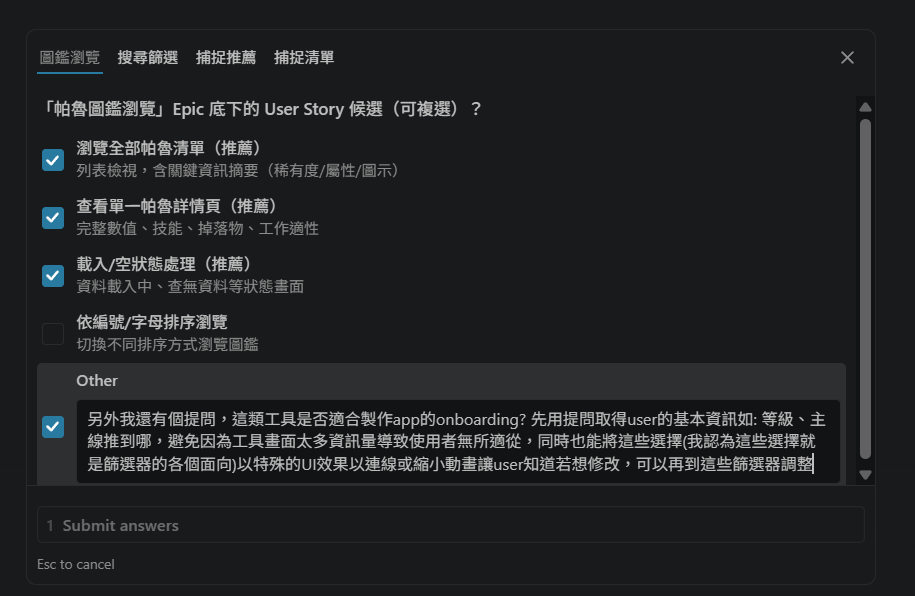
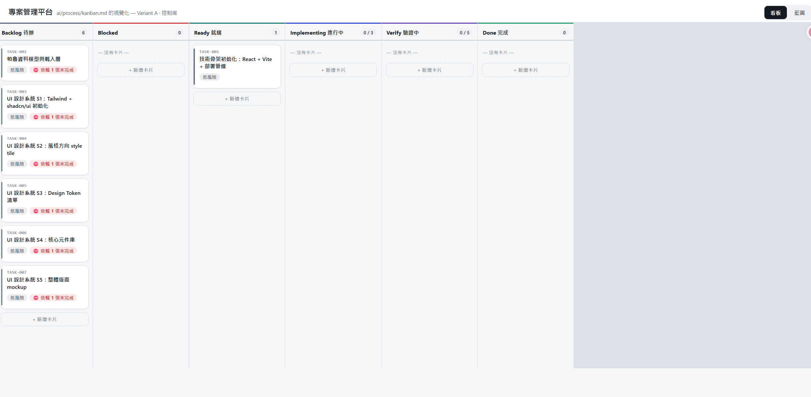

<aside>
💡
本篇文章所需工具
1. Visual Studio Code，或任何你習慣的程式編輯器、Terminal
2. Claude Code Pro 授權以上的帳號
</aside>

近期看到這篇文章：[幫產品去除 AI 味的方法：人類應該奉行減法哲學，用品味刪除不必要的產出](https://abmedia.io/how-i-design-with-ai-taste)，文章內容大概是這樣的：

1. AI 容易過度設計，而人類則需要堅守範圍，把不需要的「刪掉」。
2. 開發產品及設計過程，應該先理解整個系統，而不是馬上埋頭苦幹。
3. 開發規格書，PRD 的重要性，可以讓產品在正確的範圍內生長。
4. 產品上線後，不要直接在正式環境裡與 AI 修改產品，要改請到沙盒環境改！
5. 建立元件庫，讓 AI 修改物件時，不會每次的風格與邏輯都偏離原本風格。

## 現成工具 - Monstrare 或許可以讓 AI 協作產品更有人性

看完文章後，我抓到的關鍵字是：「AI 會 over-design」、「規格書很重要」，咦，這不就跟我近期看到的影片有異曲同工之妙？！[Vibe Coding 越做越糟？AI 寫得很快，死得更快！
](https://www.youtube.com/watch?v=cRFSIKBgrdc)

> Debug 土撥鼠是誰？他是位十分擅長使用 AI 工具的 YouTuber，我甚至能說，他是繼 Papaya 老師之後，下一位 AI/ 數位工具使用的啟蒙者。超推薦有興趣的大家多去看看！他的影片製作圖解非常好理解，甚至也有發另一部影片分享他怎麼用 AI 做影片的。（純粹分享，無業配）

這部影片主要是分享若產品開發過程，沒有給予正確的核心需求，會變得得在後續以更多時間修改，如果你曾經歷這段過程，那你一定知道成果容易越改越走針，產品偏離的機率非常大。

最近因為幻獸帕魯終於出了正式版，超級沉迷的我，遇到了網路的攻略資訊不太夠用的問題，因此我決定用「幻獸帕魯等級推薦抓取工具」作為題目，體驗看看 Debug 土撥鼠的 Monstrare。

## 建立開發環境

### 設置開發環境

Debug 土撥鼠建議使用 Terminal + Claude 完成，而我自己習慣用 Visual Studio Code，而且閱讀體驗會比 Terminal 再友善一點，因此不使用 Terminal。

> 一句話解釋：
> Terminal：可直接與電腦對話的介面。
> Visual Studio Code：對人類在閱讀上更友善的程式編輯器之一，Cursor, Antigravity 都是相似產品。

依照影片所說，依序完成以下指令

（以下皆以 Windows 環境分享，OS 環境可以參考我提供的 Time Code 檢視指令

- Time Code: https://youtu.be/cRFSIKBgrdc?si=_QomzIF0ZCq2DKx5&t=60
- Claude 官方文件：https://code.claude.com/docs/zh-TW/overview

```jsx
// 呼叫 Terminal，如果你跟我一樣是用程式編輯器，可以省略此步驟
// 桌面 -> 搜尋列 -> 輸入: cmd

// 在 Terminal 安裝 Claude Code
curl -fsSL https://claude.ai/install.cmd -o install.cmd && install.cmd && del install.cmd

// 上列指令結束後還需要設定環境變數，務必在執行指令後出現的如下類似指令複製起來輸入執行才是完成安裝
echo 'export PATH="...........

// 完成安裝後，輸入以下指令，如果出現一隻像 "章魚" 的圖案，恭喜你安裝成功!
claude

// 登入個人資訊，務必記得擁有 Pro 以上的授權，完成登入後，等待跳出授權成功，或將 Token 複製貼上到編輯器或者 Terminal
```



### 安裝 Monstrare

> 一句話解釋：
為了避免 AI 幻覺太嚴重以及成品離我們的想像太遠，因此讓人類在 AI 開發路中的角色重要性再提升。透過把開發任務拆分成各個小小子任務，並且呈現在看板畫面，由人類為個別任務審核成果。
喔對了，這個 Github 專案是開源的，目前看來是沒有資安疑慮的。
> 
1. 進入專案空間
    
    在自己喜歡的地方，先建立好專案檔案，比方說我的幻獸帕魯等級推薦抓取工具，我取作 PalPick。完成命名後，將路徑複製好，（我的路徑是：C:\Users\polar\IndieHacker\palworld）然後回到 Terminal 或者 VS Code 輸入以下指令。
    
    ```jsx
    cd [你的專案路徑]
    // 例如: cd C:\Users\polar\IndieHacker\palworld\PalPick
    ```
    
2. 複製 Monstrare 到專案裡，並完成命名，最後進入專案內部，並將 Monstrare 的原始資料刪除
    
    ```jsx
    git clone https://github.com/pjwang2022/Monstrare.git PalPick
    cd PalPick
    rm -rf .git && git init
    ```
    

## 著手開發

- 專案目標：我想以玩家等級以及主線任務進度為基準，提供玩家當下推薦抓取的帕魯

以上是我當時寫給 Claude 的專案目標，也可以寫得更完整，如果對於專案有更多具體想像的話。接下來將會出現各種選擇題，Claude 會一一與我們釐清腦中想像。



如果遇到他提供的選項不足以敘述我的需求，可以補充資訊，也可以隨時暫停請他針對我們不理解的地方著重說明。



使用 Monstrare 之後，他還會出現「專案管理平台」讓開發者可以隨時追蹤目前的任務進度與相依性，任務與任務的關係線，也能藉此掌握。



## 使用心得

大約 2 年前，生成式 AI 聲名大噪時，同事們和我都超興奮的，找了很多有趣的題目嘗試讓 AI 實踐，但效果很有限，不是畫面非腦中所想，不然就是 AI 自己腦洞大開，設想很多自認為很重要但其實超出專案範圍的功能或設計。後來知道了一些方法論，比方說：SDD。但 SDD（規格驅動開發） 對於一般沒有任何經驗的開發者而言，或許門檻較高。而 Monstrare 是一款很好入門，重點是前置作業很簡單，只需要複製這個 Github 專案，後續的需求對焦、釐清、Prototype 的討論，一步一步來，對於初級開發者而言是十分友善的。

至於我的幻獸帕魯等級推薦抓取工具？呈現效果還算不錯，只是還需要思考如何將每隻帕魯的玩家等級區間建議做到自動同步，目前我是手動設定每隻的區間，所以可以看到有些帕魯的數值是尚未完善的。另外帕魯也尚未分為戰鬥、工作、坐騎等類型區分用途，實用性還是有很多進步空間。


## 參考資料
- [幫產品去除 AI 味的方法：人類應該奉行減法哲學，用品味刪除不必要的產出
](https://abmedia.io/how-i-design-with-ai-taste)

- [AI Coding will Prevent Expertise](https://larsfaye.com/articles/ai-coding-will-prevent-expertise)

- [Debug土撥鼠 - Vibe Coding 越做越糟？AI 寫得很快，死得更快！
](https://www.youtube.com/watch?v=cRFSIKBgrdc)

