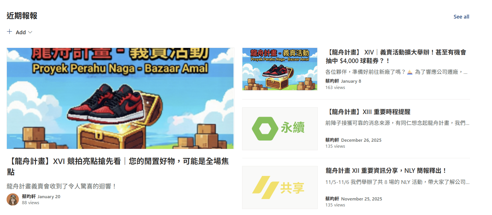
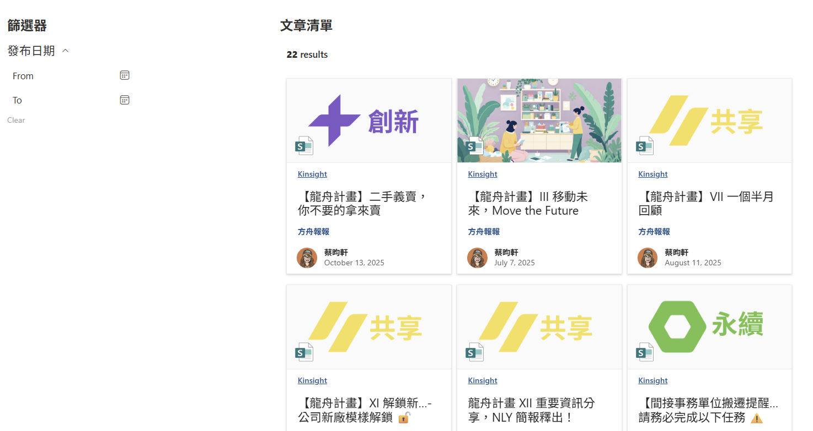
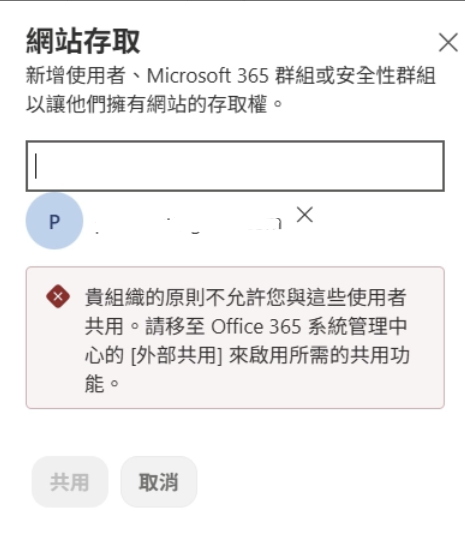
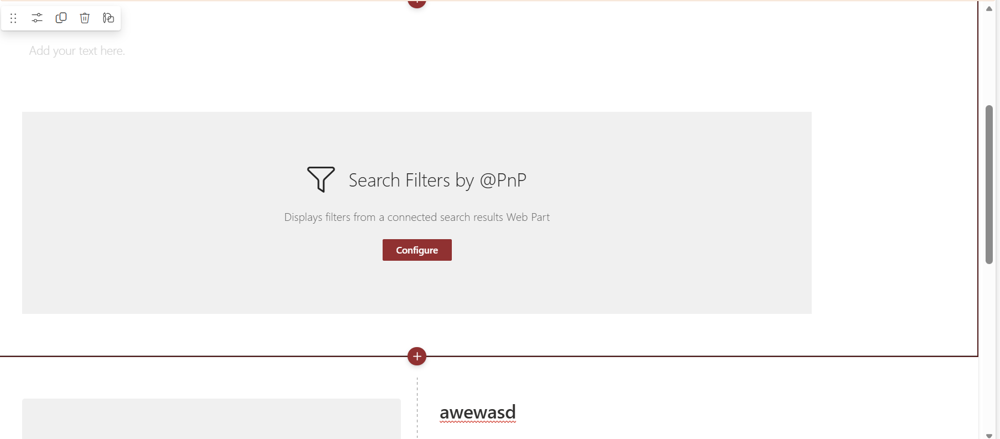

如果你跟我一樣，認為 SharePoint 只能用來當作資料庫，存取資料、查詢資料，SharePoint 更是一個可以取代 Excel 初階功能又更有視覺化的工具，那就有點可惜了。它還可以當作公司內部網站、推廣知識文章、發布公司重要訊息，甚至作為部門入口網站。

當時很偶然發現 SharePoint 具有「post」新增功能，好奇驅使下打開，真的沒有浮誇，我彷彿看到新世界。當時我在資訊部門，公司同仁對於數位工具的使用，各自程度有落差，若有個知識部落格可以提供同仁學習，就能提升公司整體對於數位工具的使用水平，這不正是教育訓練嗎！因此當我看到 Post 展開後就像我在 Bluehost 建立第一篇文章，畫面一模模一樣樣，我頓時覺得我的願望要實現了。於是我一股腦栽進去，認真研究要如何在 SharePoint 寫出一篇篇文章，並且減少同仁的閱讀摩擦力。

## SharePoint Site 的功能多元

SharePoint Site 可以做到像是部落格的排版，也能做到 Banner 版面，放上重要的置頂資訊，也能讓資訊、圖片輪播。

文章列表可能做到以下排版，讓最新發布文章佔有較大版面，同時可自行選擇顯示作者、文章標題、瀏覽人數、發布日期、文章描述等資訊。

如果文章很多篇，希望能提供同仁選擇指定的文章，SharePoint 也提供另外開發的插件可以加入，讓功能更多元，以下圖為例，當時我期望能讓同仁依照發布日期、關鍵字搜尋到自己想要閱讀的文章，因此找到「PnP - Search Results」滿足需求。基本上常見部落格擁有的功能，可以透過 SharePoint 滿足。

## SharePoint Site 的侷限

1. 若要開放公司同仁以外的外部人士查看網站，需要請 IT 部門協助開通設定。但這我認為是好的管控，通常會使用公司的 SharePoint Site 製作網站，不外乎是為了與公司同仁傳遞資訊，這些資訊內容很多都是與公司營運資訊密切相關。能在第一時間就先建立防護，可以避免資安事件產生。

2. 文章建立的入門門檻較高，而不是以 Markdown 撰寫
    
    我認為一位沒有任何製作部落格經驗的人要完成文章撰寫以及排版其實有點困難。Post 的物件建立邏輯不太直覺，比方說，我想要畫面切分 1:1 的比例，左邊要放圖片，右邊則是一個文字用以說明圖片。我建立好了版面，但圖片是另外上傳的素材，不能下意識點擊剛建立的圖片物件畫面，而是要到工作區的右側選擇以上傳方式提供圖片；而版面右側的文字段落，若想要做到段落感，會需要先知道如何從一般文字轉換成標題，或者加粗。不能以 Markdown 格式撰寫完成，也不像 Notion 這類筆記軟體，擁有友善的 UI 使使用者可以輕易找到正確的物件。
    
    要在 SharePoint 的一篇文章裡做到的我們想像中的版面呈現，而這個呈現效果要搭配哪個物件，基本上我認為會需要一點時間上手。
    
    
    

---

簡單介紹 SharePoint Site 的用途與限制，未來會再為個別功能展開說明。

如果你是從頭閱讀我本屆的鐵人賽文章，我要先跟你說聲感謝，謝謝你的逐篇閱讀。但我想你同時也會納悶怎麼畫風一變，變成技術分享？在文章選材上，我期望技術、職涯探索都能有所比例呈現。因此文章有時候會很跳，想當然，我也確實沒有擬好這三十篇的文章要如何具有連貫性。XD

既然這次選擇的主題是「自我挑戰」，那我貫徹我的初衷：分享職涯上的所想、所得、與所學。

