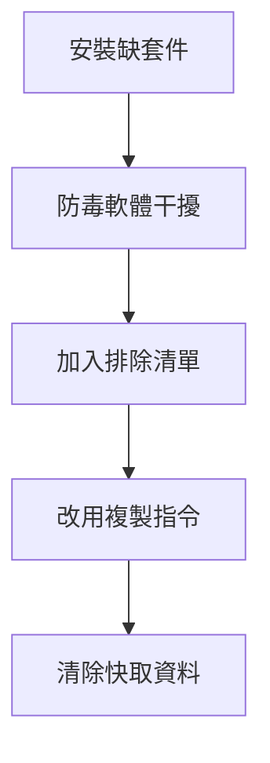
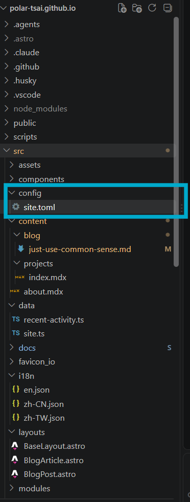

最近，我終於動工建立自己的部落格了，這幾天剛好翻看了 2021 年時建立的部落格，當時是用 Bootstrap 框架在 Github Page 上建立靜態網站，純手工，很粗糙但很可愛，裡面記錄了當時深度學習筆記、Side Project，而且點進去的內容還偷吃步，是直接附 Notion 的公開分享連結，直接省略建立文章的步驟 😆。

後來在參加 2024 年的 IT 鐵人賽時，深深覺得自己很棒，克服了完美主義產生的拖延症，完成連續 30 天發布文章的壯舉，即便沒得名次，還是對於自己的毅力感到肯定。當時就發下宏願，復興我的個人部落格計畫，只是後來改成到 LinkedIn 發文，這個計畫又延宕了。

現在因緣際會，多了很多時間給自己，以及有了生成式 AI 的幫助，終於下定決心執行我個人的部落格計畫！以下是當時與 Claude Code 開發時遇到的問題與解決方式，提供給與我相似 Pattern 的讀者一些方向參考。

## 自架部落格的框架

如果把一個部落格視為模特兒，那麼這個新部落格是這樣子的：

- 人形模特兒之於**靜態網站**
    - 考慮到快速架設，以及我的部落格目前需求：文章曝光、作品集展示，這些只需要讀者查閱，而不需要與網站互動，例如：留言、填寫表單，那麼靜態網站是最合適的選擇。
- 懶人穿搭之於 **Astro**
    - 模板選用 Astro 這樣的具有現成模板可以選擇的框架，提供給有選擇困難症、技術力較低的人（我），更快更簡單地建立好初胚。
    - 不過懶人穿搭，也還是需要自己找到合適尺寸。在 Astro 也需要將設定檔改為自己的內容，這部分除了尋求 AI 協助，可以參考後續段落提到的「架設網站所要留意的細節」。
- 展示櫥窗之於 **Github Page**
    - 身為價格敏感型消費者，能用最少的摩擦（如金錢成本、技術門檻）架設網站，以便將心力著重在文章撰寫上，這是非常重要的，因此我選擇免費的方式，就如同模特兒的展示場域有分櫥窗、伸展台，Github Page 就是便宜但又實用的櫥窗。

以上就是我所選擇的框架，至於資料庫、伺服器？沒有，目前的需求可以讓我一律從簡，Github 就是我的資料庫與伺服器。

## 路徑務必純英文且存在本機

一開始考慮到資料存在雲端就能避免哪天電腦掛了，還能有備案，不怕資料遺失。然而當我架設好環境後，發現常有奇怪問題發生：同步錯誤、資料寫入無法順利存檔。無奈之下，只好換成本機存取部落格佈署。

雖然當時的情境用這幾段話就交代了事情經過，但這卻花了我半天時間搞清楚。我總認為 AI 比我還聰明，所以基本上轉移環境時所遇到的問題都交給他判斷。起初判斷是 Windows Defender 干擾，所以加入排除清單，咦？沒有解決問題，好換 copyfile，還是沒解決，那一定是快取資料，刪掉之後，還是沒搞定。此時已經花了 4 個小時在處理這個狀況了，因此我決定重新說明事情經過，包含前面從雲端路徑搬到本機。雲端路徑是個具有中英夾雜的一長串文字，並且還包含空格。交代給 AI 之後，才知道原來走了一堆歪路…。

最後發現只需要將路徑設在本機，並且路徑越單純越好，我是設置在 `C:\Users\[使用者名稱]\dev` — 使用者名稱，選擇自己登入的帳號，當然，英文是最好的 — 然後重新安裝我選擇的 Astro 模板，問題就解決了，超級單純。



我想這應該是很多非資工人（我也是）遇到的痛，基礎知識不夠紮實，以致無法在第一時間查錯；並且有時候需要適時跳脫思考迴圈，會更有機會找到根因。

## 使用網站範本，裡面藏著魔鬼的細節

其實說魔鬼的細節就誇張了，只是想分享給想自己架設個人網站，但沒有太多相關經驗的人知道，並不是複製好人家的範本，就是一個空白的範本，裡面還包含著範例文章、原作者寫入的 SEO 設定，這些和我們自己寫出來的文章一樣重要，如果沒有做好設定，那麼在現在越來越講究好的 SEO 的時代，就會非常可惜，沒辦法讓讀者在對的時間、對的關鍵字，找到自己的文章。

比方說主要管理網站的地方: site.toml，這裡就是主要修改設定的地方，當改了這裡，網站就會自動吃這裡的設定。然而下載了模板後，有如圖這麼多檔案，肯定眼花，因此記得，只要是為了將模板改成自己的，先從 `site.toml` 開始。



> 什麼是：site.toml？
常被用於靜態網站的模板工具，如：Astro, Hugo, Jekll
簡單來說，他是個為了讓靜態網站的模板能被快速改為自己的設定，所採用的工具。
設定和內容，分開處理，設定不散落各地，有助於我們這樣的網頁新手在短時間內上手。
> 

site.toml 這個檔案，打開後其實會讓人感到有點抗拒（我也是），密密麻麻的，其實很難讓人主動去理解他。但如果願意細看，可以發現程式就像英文，依然可以理解其中意思。以範本所寫的 site.toml 為例

（先節錄 1/3 就好，不然太多程式碼看了會怕）

```jsx
[config.site]
title = "PolarVista"
description = "喜歡觀察生活事物，並將好奇心具現化，然後一一寫成文字。"
pageTitle = "PolarVista | 把好奇心具現化，把觀察與經歷寫成文字"
pageDescription = "喜歡觀察生活上的困難並試圖解決它，實作過程都會記錄在此。涵蓋公共議題、開發日記、第一線問題，還有理財筆記。"
url = "https://polar-tsai.github.io/"
repository = "https://github.com/dodolalorc/astro-navfolio"
footerNote = "© 2026 PolarVista. Built with curiosity."

[config.theme]
# 可用色盘：
# green-soft, green-vivid, rose-soft, pink-soft, purple-soft, blue-soft, orange-soft, brown-soft
palette = "green-soft"
# 原生 UI 语言。可用值：en、zh-CN、zh-TW。未知值会回退到 en。
lang = "en"

[config.fonts]
# 英文与代码感 UI 字体
en = "Maple Mono"
code = "Monaco"
# 模板内可直接选择：ChillRoundM、LXGW WenKai
# 中文阅读字体
zh = "ChillRoundM"
# 中文完整字体文件
file = "/fonts/ChillRoundM.ttf"

[config.code]
lightTheme = "catppuccin-latte"
darkTheme = "catppuccin-macchiato"
lineNumbers = true
wrap = true
preserveIndent = true
collapseStyle = "collapsible-auto"
```

這串程式碼大致上是為了讓網站有個依歸，比如網站名稱、網站描述、網站連結、網站顏色與風格、以及字體選擇和語系，若像是字體，需要獨立一頁說明，就會有 `“/fonts/ChillRoundM.ttf”` 表示字體文件是放在哪裡。

## 架設網站的心得

這次的架設經驗，其實還是讓我回到以前自學 Python 的時光，依然會出現各種問題需要解決，也常常出現能力外的問題，以前需要靠自己或翻網路上前人是否有類似錯誤，不斷去修正程式。現在架設網站，寫程式的任務交給 Claude，但依然還是有底層設定或者架設環境問題需要解決。不同的問題類型，不變的是需要耐心地抽絲剝繭，追溯最靠近問題錯誤的根源，慢慢找到解決方法。

坦白說，生成式 AI 確實帶給沒有任何或初級撰寫程式經驗的人類很多想像空間，但還是有很多先決知識需要掌握，才能更有效率地達到目的：比方說 **IT 知識**

1. 可以**明確說明技術問題**：指令給對，答案就先給一半；指令給錯，和 AI 探討老半天依然找不到答案。
2. **更快拆解出問題點**：網路的世界虛無飄渺，這應該是非資工人一致的想法。身為一個在 IT 部門但主責不是 IT 的軟體開發，我認為 OSI 七層模型超萬用（之後分享我如何應用它），不是只能用在網路架構，也能用在面對軟體問題時的拆解步驟。
