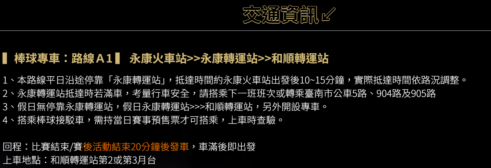
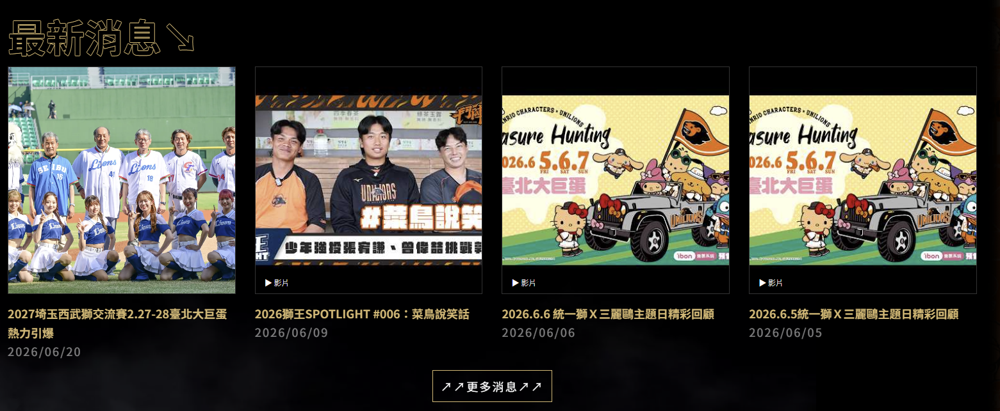
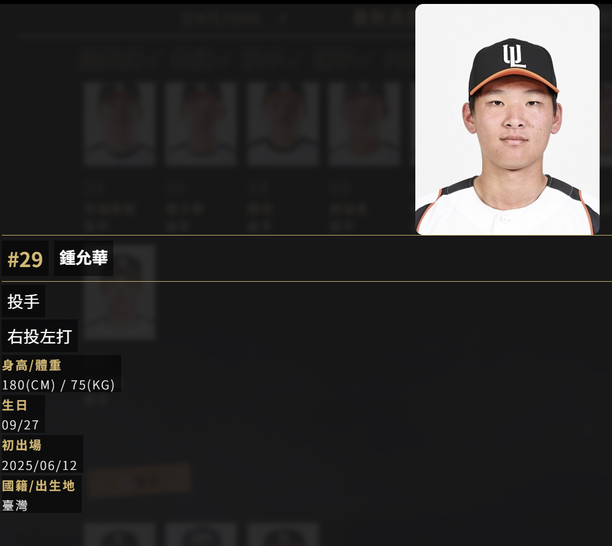
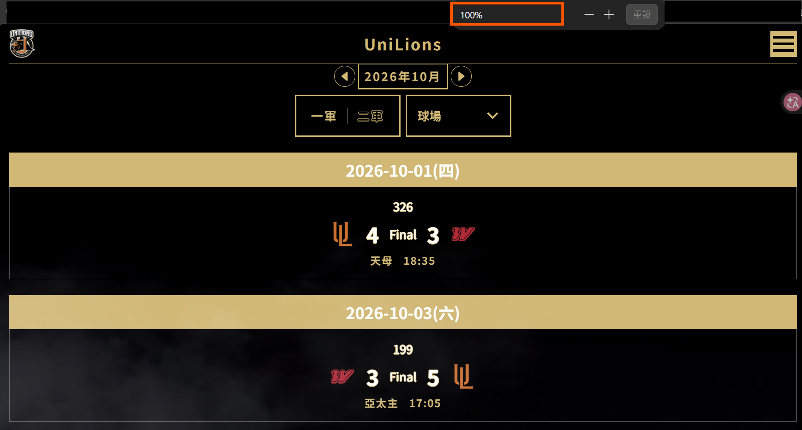
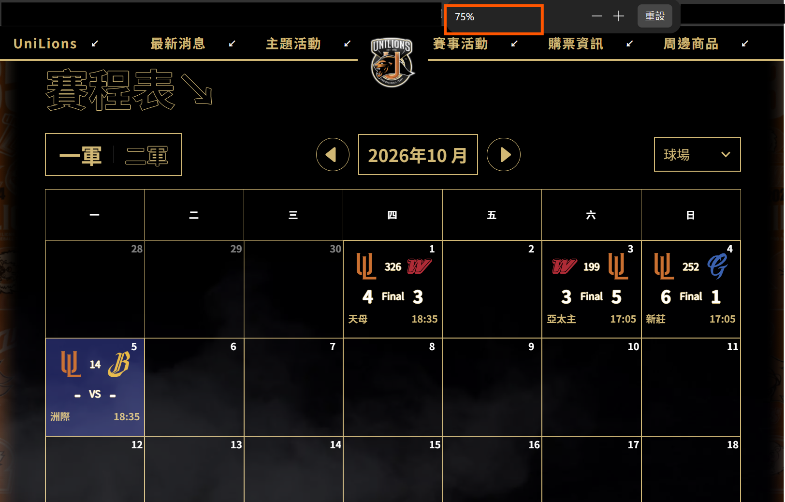

## 起源

我是 2019 年看了 12 強台灣以 7:0 完封韓國，熱血回鍋的獅迷，為什麼是回鍋？小時候看過我爸支持統一獅，因此藉著童年回憶選擇喵喵。我很喜歡到場看球，氛圍很舒服、跟陌生人一起為了同一件事物吶喊歡呼的感覺真的很讚，只是觀賽資訊的取得與體驗，有以下幾點有待加強。

## 痛點

1. **交通資訊有出入**：過去曾遇到接駁車與工作人員說明時間有誤，導致我連最後一班接駁車都沒坐到，得自費計程車回高鐵站的窘境…我看了官網的畫面，依然提供錯誤資訊（那天還是延長賽打到 22 點多...，隔天還要北上起床上班，超幹）
    
    
    
2. **新官網資訊落後**：同為獅迷的另一半基本上習慣都在統一獅官方粉專取得活動資訊，例如：比賽資訊、商品資訊、賽前活動、入場禮、交通資訊。統一球團的官網資訊，UX做的不直覺就算了，資訊也沒有保持最新（現在 10 月了還在輪播 6 月的雙獅日、菜鳥說笑話，鍾允華的專訪呢？？）
    
    
    
3. **球員資訊簡陋**：CPBL 官網好歹還會給予球員選秀輪次，大統一獅官網竟然沒有，都是自家球員了，給一下喜好、興趣之類的讓球迷更認識我喵球員嘛。
    
    
    
4. **UI 畫面呈現的尺寸根據不符合使用者的載具使用**：以賽程表分頁為例，以我的筆電畫面呈現的是這樣的，右上角有漢堡選單，猜測是提供給手機使用者的畫面，但其實我期望的是能以更符合寬大畫面使用者的需求呈現資訊，結果我縮小後發現...原來有做了行事曆的檢視畫面…
    
    
    
    
    
5. **比賽賽程表應顯示當日天氣**：或至少提供降雨機率，我知道 CPBL 官網會提供，但既然都做了統一獅官網了，是否能將資訊整理得更完整？

以上簡單羅列個人所遭遇的痛，也同時是網路上喵迷們的願望
請參考：
1. [Re: [閒聊] 能期待有個統一獅app嗎？](https://www.ptt.cc/bbs/Lions/M.1629487428.A.1E4.html) 
2. [[閒聊] 能期待有個統一獅app嗎？](https://www.ptt.cc/bbs/Lions/M.1629486255.A.226.html)
3. [Fw: [討論] 球隊沒有官網和App，真的不會怎樣嗎？](https://www.ptt.cc/bbs/Lions/M.1746463790.A.7DE.html）

後續會一一分享 Prototype, 開發規劃、預期效果。

