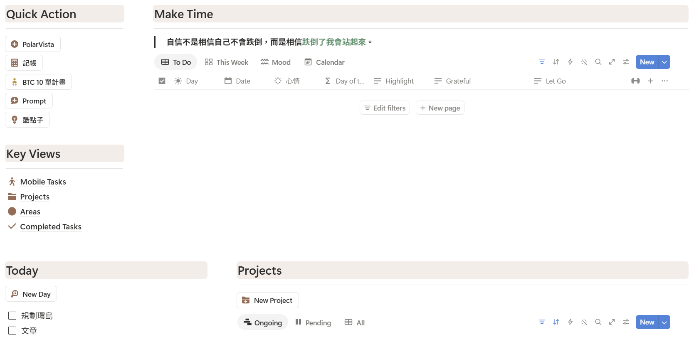

這本書《暢玩一人公司》主要是以「寫作」作為建立一人公司的核心方式，因此本篇文章會以這個目標留下想法並且思考近期的寫作節奏並將調整內容一併寫出與檢視。

## 點子總是稍縱即逝 p. 50

作者于為暢在書中提到，想的到比做得到再難一點，如果要能讓想到的點子都能好好記錄，需要有個媒介存起來，比方說 iPhone 的 inbox、手邊的小本本，這些唾手可得的工具，只要能在靈光乍現時，能夠快速存下好點子就是好的工具。但像是我的工具非全蘋果工具、而 Notion 若要在手機快速打開，需要一點讀取時間，這很容易產生摩擦力。比方說，突然有個好點子需要紀錄，此時我從先用 Face ID 開啟畫面，然後點擊 Notion Widget 後，依照我這台用了 3 年的二手老 iPhone XR 還需要再等個 5 秒才會開啟 Notion 畫面，並且還要再找到按鈕建立新點子，這個過程等待時間不下 10 秒，更別說整個過程中，那些等待時間會不會被通知、Instagram 吸引注意力。因此目前還是會先快速寫在 Line 的個人群組裡，就是那種把朋友加入之後再移除他們的個人群組，開啟最方便又快速。

## 維持寫些什麼而不只是規劃 p. 55

> 隨興產出 → 市場回饋 → 做出調整
> 

這是我最容易掉入坑裡的症頭。比起實踐，我更喜歡規劃，因為這不會有風險需要承擔、不需要擔心會不會沒人看、會不會被批評、會不會太隱私。但事實上，從零開始到有人關注、有人批評，其實還有很長很長的路要走。但如果我選擇下場走完這段，我的文筆也一定會在這個過程就變得更精準，而這樣的轉變肯定會提升我對於自身文章的信心。因此，就寫下來吧！

1. 前晚應擬定待辦事項、待寫文章題目
2. 完成一件任務後再給甜頭、滑手機
3. 將主題化整為零，小而精的題目並深掘
4. 將文章轉換成其他輸出方式：簡報、影片、Podcast 等等

我知道我要「寫文章」，但實際如何進行並且讓這項任務有更多附加價值？我認為上面這四點，出於于為暢老師所給予的步驟已大致解答我的疑問，並且也考慮到容易滑手機的我應該如何先做正事。目前我的方法是採用 Jeff Su 的 Notion 模板搭配過去工作習慣，將每日待辦事項都以按鈕快速建立，並且在前一晚就先制定任務，使自己打開電腦，就知道哪些事情必須完成；主題化整為零，這部分我反而選擇不指定題目方向，而是先做好一件事 — 「維持每天寫作」。因此我搭配 iThome 鐵人賽，鎖定自己喜歡有個打卡機制的偏好，促使自己每天都要有文章產出。也幸好我的鐵人賽題目不是選擇指定主題，因此現在的我寫作上其實減少很多壓力，想到什麼就寫什麼～哈哈，目前也寫了 15 篇了，我認為大家會到 iThome 找文章應該也是點狀搜尋而非帶狀閱讀，因此我自認這樣的文章寫作題目不會太影響讀者閱讀體驗。

## 提升工作效率：閉關 p. 85

### 好的閉關場域：圖書館

所謂的閉關就是在一個特定時間、空間之下，沒有任何人事物打擾，讓自己進入心流，執行輸出或輸入的任務。輸出指的會是：寫作、軟體開發、做影片等等；輸入的話就像是：閱讀書籍、研究新事物等等讓自己增廣見聞的事物，將思緒、情緒都重新整理、沉澱歸零。

目前我找到最好的地點就是：圖書館。這個地點出現的人大多是想要強化自己的學生、民眾（那些來圖書館睡覺、用公用電腦看影片的暫且不提），所以讀書風氣是很好的，臉皮薄如我當看到他們非常認真做自己的事情，本來想偷懶的心情都會覺得不好意思。同時圖書館提供電源、水源，又有洗手間，人類的基本需求都被滿足了，是個超級適合閉關的場域。只是圖書館通常都需要早於開館的 8:30 抵達，才有餘裕尋找自己喜愛的充電筆電區，學生要考試、民眾想考公務員，這些人都是超早就在圖書館門口排隊的人啊！

### 定期每次短時間的勿擾期間，也能是閉關

于為暢老師在他的一本書籍產出是使用 6 個周末，共計 50 小時的時間在圖書館撰寫完成。可以發現，如果場域合適、干擾物極低，其實也可以將閉關切分。這個方式讓我也想嘗試看看，用在閱讀之前在職時買入的好書、開發那些我已經挖了坑但還沒填的好想法、將這些產出歷程寫成文章。依照心情選擇每天閉關時間或半天或整天（若是整天就要記得帶點小點心，避免中途餓到得外出覓食），時間可以拆開，但一定得讓自己進入「心流狀態」。而整體時長，先以一本書的閱讀時間為一單位，如 20 小時（若以半天即 4 小時為單位），再慢慢拉長總時長。

