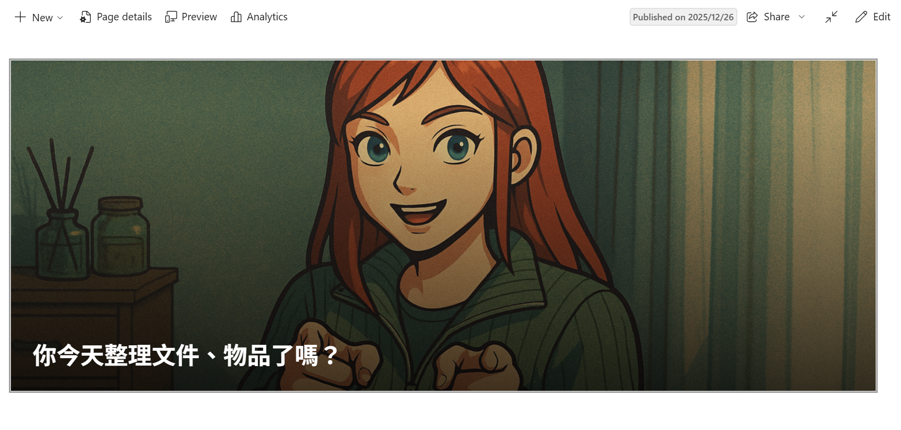

有時候我們認為的，或者課本給我們的觀念，其實都與事實大相逕庭。小時候曾讀過非洲國家有很多飢餓的小孩，甚至餓到皮包骨，已經沒有力氣進食，必須有人協助餵食液態食物。但其實非洲國家也已經高樓林立，有馬路也有汽車。

不是只有科技新知要更新，對於世界的認識也需要不斷更新。

## 二分化直覺偏誤

「已開發」↔「開發中」；「低所得」↔「高所得」；「富豪」↔「赤貧」

上述的二分法，是我們、媒體對這個世界的解讀，而**兩者之間往往直覺會認為有很大的一條鴻溝**，深深切開兩群之間的關聯。

看完作者書中所寫，我私自想出兩個根因：

## 書中歷史 - 但其實可能就只是歷史

還記得小時候(2003年)從課本學到的，就是非洲小朋友**都**餓到皮包骨，只能用極少麵粉裹著泥沙做成餅止飢。但其實現在2022年了，可以從這位來自甘比亞的YouTuber回甘比亞所拍的影片可以看到，生活機能已經大有進展。

## 四個所得分級(p.46)

| 級別 | 收入 | 水源 | 交通工具 | 煮飯器具 | 食物 |
| --- | --- | --- | --- | --- | --- |
| **第一級** | 1鎂/天 | 到遠處打水 | 赤裸的雙腳 | 撿木柴燒飯 | 糊糊的沒多少米飯的粥 |
| **第二級** | 4鎂/天 | 有塑膠桶可裝 | 腳踏車 | 瓦斯 | 養了雞 生了雞蛋 |
| **第三級** | 16鎂/天 | 水龍頭 | 機車 | 瓦斯爐 | 營養豐盛 |
| **第四級** | >32鎂/天 | 流理臺 | 汽車 | 中島廚房 | 不只營養還能吃過胖 |

## 報導常是極端的集合物 - 是閱聽人的偏好所致?

媒體常利用極端例子和搭配聳動標題來吸引眼球。而不只媒體，電影、紀錄片、遊說團體的網站等等，其實都會使用正派、邪惡，小蝦米對抗大鯨魚種種兩個群體之間的對立。

## 如何扭轉二分化直覺偏誤

### 比較平均值

1. **y軸提供的數值範圍，會影響圖表的呈現**。造成對圖表的誤解 (p.52)
2. 不應只檢視平均值，應再**檢視整體分布**狀況

### 比較極值

每筆圖表都一定會有極值的產生，但通常**圖表的整體分布多會在中間值**，不應只將重點著重在極端值。

### 別用自己高高在上的目光看著所有事物

別用自己的個人生活經驗套用在世界上的所有事物

→ 第一級到第二級，雖然每天收入只是從1鎂提升到4鎂，但其實生活品質卻有可觀的提升。然而這樣的改變對生活在第四級的我們卻不會感受箇中差別。

