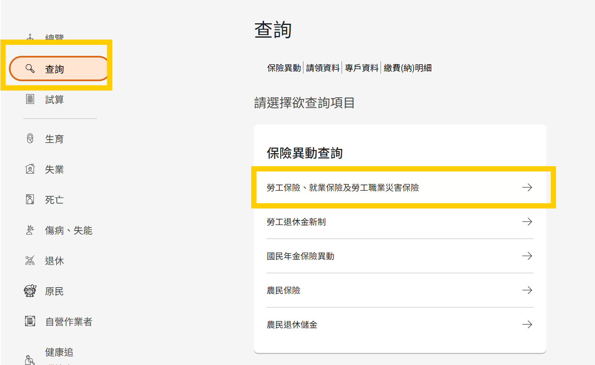
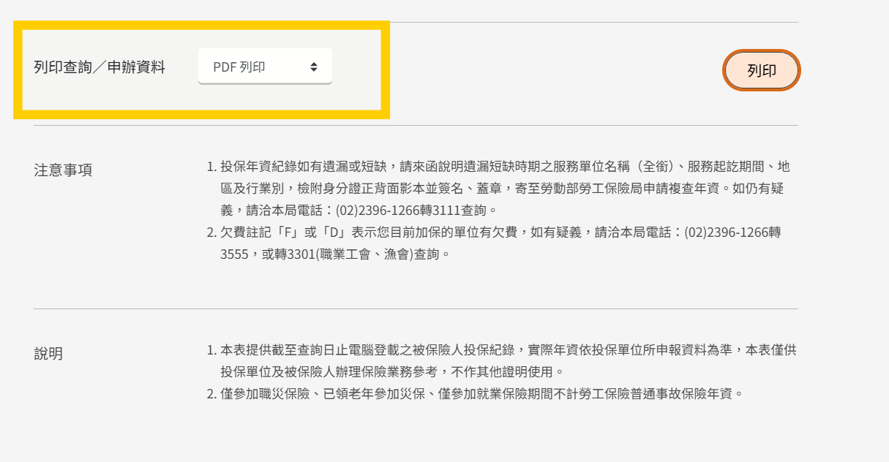
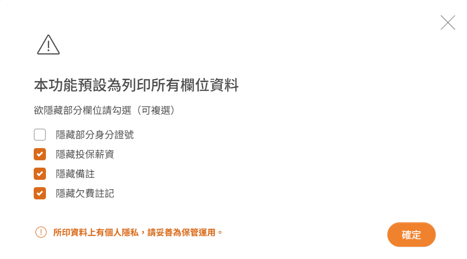

## 諮商前準備

烙在 DNA 的省錢觀，讓我秉持著追求效益最大化。畢竟一堂心理諮商要價上千，肯定是要讓心理師能在最短時間掌握我的現況啊！因此我做了以下準備：

1. 提供並整理與 AI 討論過的心理紀錄
    
    由於我習慣遇到情緒、低潮時，都會講給 AI 聽（以前曾用過 ChatGPT, Gemini, 現在改用 Claude，因為有付費），我認為處在負面狀態時，話說的都是破碎片段的，因此能讓 AI 把歷程紀錄都保留，並且做成 A4 大小的資訊，能很快速地讓心理師在最短時間內釐清重要資訊。
    
    以下是我下的指令：
    
    ```jsx
    請參考過去與你討論過關於心理、情緒層面的資訊，幫我整理一份A4篇幅的個人狀態以及職涯規劃、以及我的個人價值觀養成。
    這個產出是給心理師看的，期望他在最短時間內掌握我的狀況
    ```
    
2. 如果要使用在職勞工諮商，務必要為「在職勞工身分」，也就是擁有勞保記錄，才能符合資格。申請管道：[勞保局e化服務系統](https://edesk.bli.gov.tw/me/#/na/login)
    - 一律**推薦使用手機認證**，最方便無腦。只是認證過程請記得關閉 Wifi，使用手機本身的網路哦！
    
    
    
    - 往下滑，找到：`列印查詢/申辦資料`後，選擇 **PDF 列印**
    
    
    
    - 可以選擇**只顯示身分證字號**，其他如欠費註記、薪資等個人資訊，都可以選擇隱藏，只要能確保這份**勞保紀錄是本人**、並且在**紀錄會出當下為在職**即可。
    
    
    
3. 找到有與在職勞工諮商方案合作的諮商所：[心理諮商機構快速查詢](https://ohh.coapre.org.tw/home)
    
    並不是每間諮商所都有與勞健方案合作，因此請務必確認過，才能享受免費的心理諮商。坦白說，這項補助案其實沒有太多資訊可以在網路上取得，關鍵字也很難下，當時我是在之前執行心理諮商的諮商所所發布的文章才知道這項補助，還有在 7、8月時參加職涯博覽會，逛勞工局攤位才知道有這項好康，因為當時我只知道有青壯諮商方案，想說怎麼有這麼好的事，**在職勞工基本上就能獲得 6 次的免費諮商**耶，一直看到心理諮商所的文章才真正確認這是實實在在的政府資源。
    

## 在職勞工心理諮商結束後接著使用青壯方案？

昨天有提到在職勞工心理諮商能不能接著使用青壯方案，讓免費的諮商次數能增加成 6 次，答案是可以的！不過還是建議要使用資源的各位要到諮商所再次確認比較保險唷！

而且諮商頻率，以這兩項政府補助的諮商規則而言，是有要求得在 7 日~30 日間進行下一次的諮商。所以保持節奏完成諮商吧！

