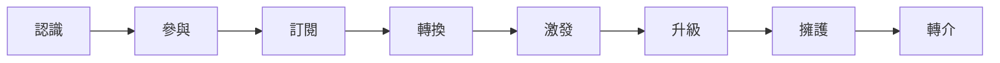

## 如何變現？客戶價值旅程 p. 99

書中提到的是以客戶價值旅程掌握在個人品牌建立路上，提供各個階段需要改善與加強的方向，又或者說，整條旅途上相應階段的設計重點。

1. **認識**：增加管道以提升個人品牌的能見度給 TA（Target Audience），比方建立社群帳號並成為活躍的創作者、優化文章 SEO、參加演講或工作坊、請 KOL（關鍵意見領袖）推薦自己。我曾在一個選舉文化探討的講座聽到講者說過：「若能在一位民眾面前出現超過 3 次，那這位民眾就會對該候選人產生更深刻的印象。」保持曝光度，並且是**出現在自己所設定的 TA 眼前**，讓他們產生怎麼哪裡都能看到我的錯覺。
2. **參與、訂閱**：這兩個階段我想放在一起講，基本上就是讓 TA 願意從單向資訊傳遞，變成雙向溝通，除了願意提升互動，也願意主動建立橋樑，定期閱讀我的文章/電子報。在此階段也能開始進入篩選哪些人是真的對我有更近一層的接觸意願，這些就是「基本客戶」。數位時代的一天一 AI，我認為是個很好的例子，他雖然是數位時代的專欄系列文章，但作者韋惟珊積極出擊，在文中提供表單，讓讀者可以分享閱讀心得、困擾、實踐成果，除了獲得客戶名單以外，也能掌握 TA 目前在工作場域所遇到的困難並作為未來的撰寫方向，製造作者、讀者的雙贏局面。
3. **轉換**：這部分于老師的看法很有意思，喜歡自己所寫文章、崇拜自己的人不見得會對產品買單；會購買產品的人，不見得喜歡文章或我這個人，單純認為產品是他所求。在這個階段，如果能讓潛在客戶正式下單，產生第一次成交，這會是很大的里程碑，促使他再次下單已經比第一次購買的難度低很多。不過在這裡，于老師的看法是第一次購買先以低價為策略，這個定價策略我認為會是一門哲學，訂太低，品牌形象是否會影響？訂太高，會不會嚇走潛在客戶？
4. **升級**：我認為這部分有應用行銷學理論，如何讓客戶認為買到賺到，並且讓他買更多、買更快、賣更貴？書中例子舉得太妙了，是以麥當勞套餐為例，假使漢堡是低利潤，但搭配套餐的薯條、飲料就能取得高利潤（買更貴），若 +49 元可以得到一個兒童玩具（買更多），最後客人因為好吃一直吃，選擇儲值 500 元的點點卡，之後可以慢慢用（買更快）。
5. **擁護、轉介**：有些人會主動擁護品牌並願意無償推廣，且感到榮幸，這些人就是自己的擁護者，而若又能為品牌建立**聯盟行銷**機制，更能產生更有效率的擴散。

## 變現方式，以擅長的方式選擇或全都要 p.117

于為暢老師將變現方式整理出四種：

1. 流量變現：將網站經營的具有足夠流量，賺取廣告收入。
2. 內容變現：寫一篇可以賺錢的文章，比方說約稿、業配文、廣告文案、聯盟行銷。
3. 專業變現：將自己的專業結合蒐集好的客戶名單、可展示專業作品的管道，開始販售自身專長。
4. 品牌變現：利用自己的正字標記已經在業界是個擦亮的正面招牌，出書、擔任講者、舉辦活動等等，都會是在此方式的營利管道。

而其中，又以若能露臉曝光會更有效率。不過內向如我，選擇我舒服的方式：耕耘部落格，並且透過生活上的見聞，或寫成文章、或實踐成果、或寫成聯盟行銷的真心推薦文，我會更來得心安理得。啟蒙我撰寫個人部落格的 Dr.Dean、讓我知道 Notion 的強大威力的雷蒙，都以各種形式告訴我：在這個可以用 AI 做成各式內容農場，且 SEO 又做得精緻，搜尋引擎打開前幾個結果都是 AI 建立的網站，在這樣 AI 大肆生長的世界，若想透過部落格文章脫穎而出，就**必須讓文章保持「人味」**，**在文章裡留下各種人類的痕跡**，例如生活發現、經歷（失敗經驗更獨一無二）、個人看法、實踐過程。

我知道這把「文筆」的刀還不夠鋒利、「思考宏觀性」的刀也尚待打磨，因此藉以鐵人賽的發文機制，持續敲打這兩把刀（無獨有偶，于老師也在 p.149 最先磨練的正是寫作技能）。

---

## 產品定價策略 p.136

近期演算法常常推給我關於如何知識變現、創立一人公司的廣告，有些文案寫得很好，因此我進去聽了不下 7 堂的課程，我大致整理了以下四種模板：

1. Instagram 廣告 → 15 分鐘的免費知識影片（內容可能包含過去創業談、個人經歷與所談主題會遇到的難點） → 提供一頁式學習地圖 / 網頁出現報名連結參與為時 2 小時的體驗課程 → 課程結束給予正規課程優惠碼 → 廣告時間
2. Instagram 廣告 → 報名課程 → Mail 出現 Line 官方帳號 → 加入後給予體驗課程連結 → 課程結束給予正規課程優惠碼 → 廣告時間
3. Instagram 廣告 → 報名課程 → Mail 出現為期 2 天共計 6 小時的體驗營 → 課程結束給予正規課程優惠碼 → 廣告時間
4. Instagram 廣告 → 報名課程 → Mail 出現為時 2 小時的體驗課程 → 課程結束給予正規課程優惠碼 → 給予生態圈資源如 Discord 社群連結、Skool 連結 → 廣告時間

前面的社群軟體，會依使用者常用的軟體而變（我自己是很喜歡滑 Reels，所以都被 IG 廣告打到）。除了他們真的都是真人教學，提升信任感、並時常在過程積極與觀眾互動以外，個別創作者不約而同在課後都會給予優惠碼，並表示課程優惠只開放 2 小時，之後恢復原價；同時會加碼一項優惠，前 x 位完成報名且成功付費者享早鳥優惠。

對應于為暢老師在「產品定價策略」章節，以上創作者使用的正是老師提到的方式，課程價格定價訂高，並且也會搭配免費課程一同販售，價格不同，但是兩套課程品質都需要保持良好，為什麼呢？以下分享我的經驗。這七位創作者都會先以免費課程作誘餌，他們會發揮個人風格，以不同形式分享自己的課程內容，可能是分享框架也可能是點到為止，也讓觀眾知道他們的水位在哪裡，免費課程的品質保持良好，就能使觀眾看得意猶未盡，也感到他們的痛點被發現，亟需有個引路人協助他們完成目標，點出觀眾的痛之後，會有些觀眾選擇在此時購買課程，如此需求就能適時被供應方接住。

其中有些創作者也會建立生態圈，提供環境使社群保持活躍、維持討論風氣，讓整個生態生生不息成為有機體，當人在環境裡建立關係後，黏著度不容忽視。

## 個人品牌之工具應用 p.143

于老師在本章節提到很多他的 trial and error 後的結晶，以下僅作整理

- 網域購買：GoDaddy（便宜）, Gandi.net（可發票報帳）
- 主機：Linode, Google Cloud
- 廣告投放 - 流量變現：Google Adsense（累積 15-20 篇最好千字+的文章）
- 付費文章 - 內容變現：創立付費會員才能加入的社群、WordPress - MemberPress, Paid Memberships Pro
    - 若要做到這點，如果讀者與我一樣都是將文章寫在 Github Page 這類基本上是被爬蟲爬光光的（靜態）網站，那這條路得換條走看看了。
- 付費課程 - 專業變現：LearnDash（外掛到自己網站，須付費）
- 篩選讀者是否願意付費
    - Email 行銷 - Service Provider( Email 行銷平台商，a.k.a. ESP）： ConvertKit, MailChimp
    - Landing Page - 銷售頁，專用於展示產品：Brizy
- 選擇工具的注意事項
    1. 是否為正派公司、持續成長
    2. 客服管道是否暢通
    3. 價格合理性
    4. 支援中文字體，至少支援 Google Custom Fonts
    5. 遇到喜歡的工具，可以選擇付費支持，讓這些公司營利也讓工具變更好

